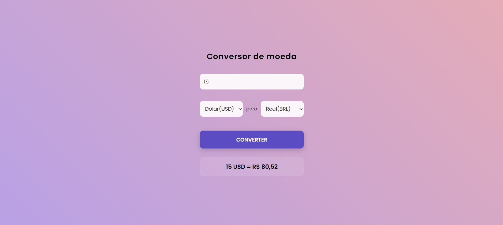

# Conversor de Moedas em Tempo Real
Este é um projeto de conversor de moedas moderno e responsivo, desenvolvido com HTML5, CSS3 e JavaScript puro. O aplicativo consome dados em tempo real de uma API externa para fornecer cotações atualizadas e precisas.

🚀 Funcionalidades:

Cotações em Tempo Real: Integração com a AwesomeAPI para obter os valores mais recentes do mercado.

Interface Glassmorphism: Design moderno utilizando efeitos de transparência e desfoque.

Validação Dinâmica: Tratamento de erros para valores inválidos ou campos vazios.

Feedback ao Usuário: Mensagens de status durante a busca de dados e formatação automática de moedas (BRL, USD, EUR, etc.).

Responsividade: Interface adaptável para diferentes tamanhos de tela.

🛠️ Tecnologias Utilizadas:

HTML5: Estruturação semântica do projeto.

CSS3: Estilização avançada, animações de gradiente e efeitos de vidro (Glassmorphism).

JavaScript (ES6+): Lógica de programação, manipulação assíncrona com Async/Await e consumo de API via Fetch.

AwesomeAPI: Fonte de dados para as cotações de câmbio.

📝 Estudo:

Projeto desenvolvido com intenção de revisar e aprofundar os conhecimentos acerca do JavaScript. Com apoio da IA (Gemini) para revisão de problemas encontrados no desenvolvimento do JavaScript, especificamente nos pontos de uso de crase para os valores dentro da url do AwesomeAPI, assim como a criação do tratamento de erros.

Adicionalmente, uso do gemini para desenvolvimento do CSS, em relação a aplicação do efeito de glassmorphism, estilo de visual moderno aplicado para melhor conhecimento pessoal das novas formas de estilização usadas na atualidade.

